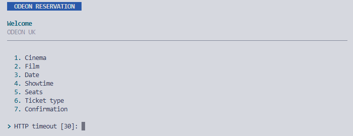
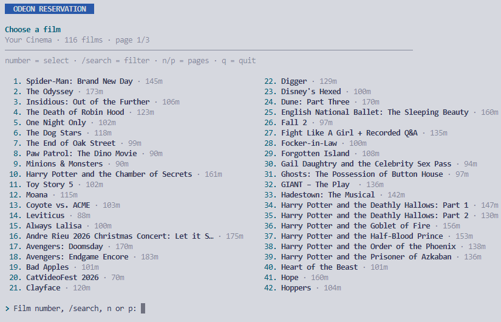
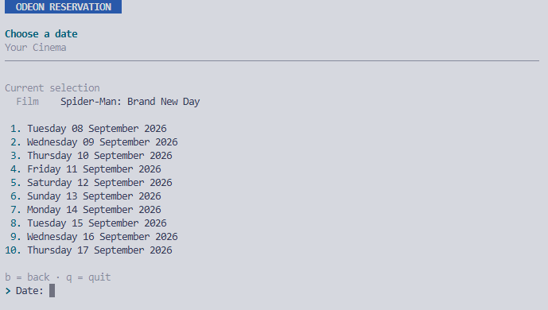
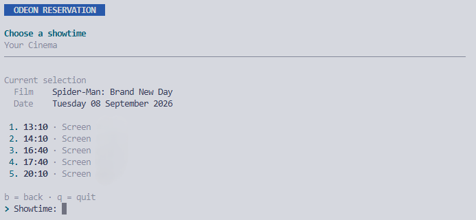
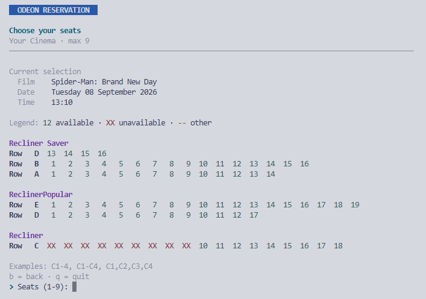
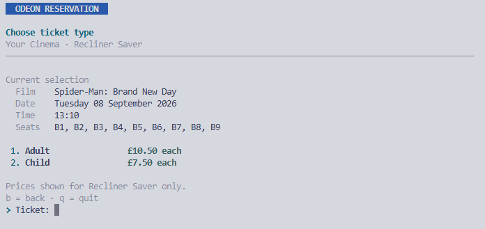
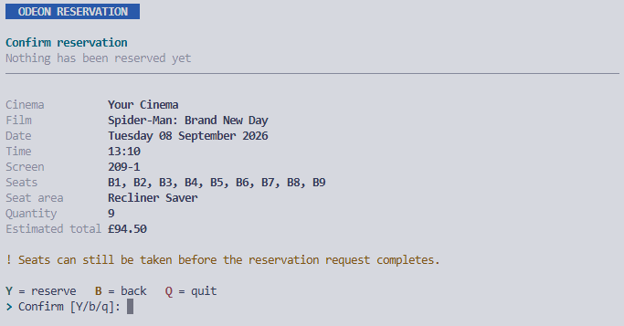
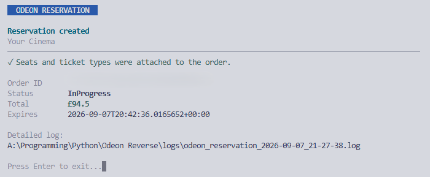
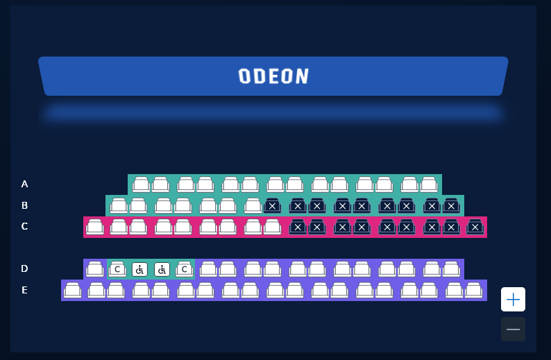

# ODEON Seat Blocker

CLI tool to block up to 9 seats at ODEON cinemas for 12 minutes at a time.

## What it does

Blocks seats to make cinemas appear busy without actually buying tickets. Run repeatedly to keep seats blocked indefinitely.

## How it works

1. Select cinema, film, showtime
2. Choose seats (e.g., `C1-4` for seats C1-C4)
3. Blocks them for 12 minutes
4. Run again to re-block

## Visual Guide



















## Install

```bash
pip install requests
```

## Use

```bash
python odeon_reservation.py
```

## Note

- Max 9 seats per run
- Blocks last 12 minutes
- Re-run to maintain block
